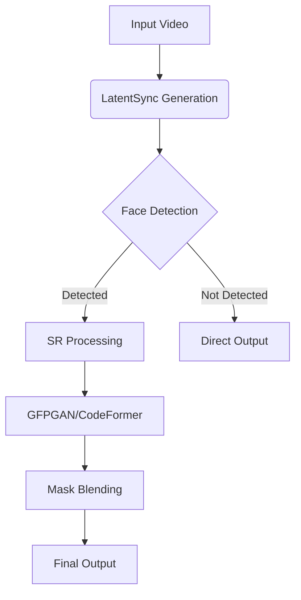

# LatentSync: Audio Conditioned Latent Diffusion Models for Lip Sync

<div align="center">

[](https://arxiv.org/abs/2412.09262)
[](https://huggingface.co/spaces/fffiloni/LatentSync)
<a href="https://replicate.com/lucataco/latentsync"></a>

</div>

## 📚 Abstract

We present *LatentSync*, an end-to-end lip sync framework based on audio conditioned latent diffusion models without any intermediate motion representation, diverging from previous diffusion-based lip sync methods based on pixel space diffusion or two-stage generation. Our framework can leverage the powerful capabilities of Stable Diffusion to directly model complex audio-visual correlations. Additionally, we found that the diffusion-based lip sync methods exhibit inferior temporal consistency due to the inconsistency in the diffusion process across different frames. We propose *Temporal REPresentation Alignment (TREPA)* to enhance temporal consistency while preserving lip-sync accuracy. TREPA uses temporal representations extracted by large-scale self-supervised video models to align the generated frames with the ground truth frames.

## 🏰️ Framework

<p align="center">

<p>

LatentSync uses the [Whisper](https://github.com/openai/whisper) to convert melspectrogram into audio embeddings, which are then integrated into the U-Net via cross-attention layers. The reference and masked frames are channel-wise concatenated with noised latents as the input of U-Net. In the training process, we use a one-step method to get estimated clean latents from predicted noises, which are then decoded to obtain the estimated clean frames. The TREPA, [LPIPS](https://arxiv.org/abs/1801.03924) and [SyncNet](https://www.robots.ox.ac.uk/~vgg/publications/2016/Chung16a/chung16a.pdf) losses are added in the pixel space.

## 🎮 Demo

<table class="center">
  <tr style="font-weight: bolder;text-align:center;">
        <td width="50%"><b>Original video</b></td>
        <td width="50%"><b>Lip-synced video</b></td>
  </tr>
  <tr>
    <td>
      <video src=https://github.com/user-attachments/assets/ff3a84da-dc9b-498a-950f-5c54f58dd5c5 controls preload></video>
    </td>
    <td>
      <video src=https://github.com/user-attachments/assets/150e00fd-381e-4421-a478-a9ea3d1212a8 controls preload></video>
    </td>
  </tr>
  <tr>
    <td>
      <video src=https://github.com/user-attachments/assets/32c830a9-4d7d-4044-9b33-b184d8e11010 controls preload></video>
    </td>
    <td>
      <video src=https://github.com/user-attachments/assets/84e4fe9d-b108-44a4-8712-13a012348145 controls preload></video>
    </td>
  </tr>
</table>

## 💑 Open-source Plan

- [x] Inference code and checkpoints
- [x] Data processing pipeline
- [x] Training code
- [x] Super-resolution integration

## 🔧 Setting up the Environment

Install the required packages and download the checkpoints via:

```bash
source setup_env.sh
pip install gfpgan basicsr
git clone https://github.com/sczhou/CodeFormer
cd CodeFormer && python scripts/download_pretrained_models.py facelib
```

File structure after setup:
```
./checkpoints/
|-- latentsync_unet.pt
|-- latentsync_syncnet.pt
|-- whisper/
|-- auxiliary/
|-- CodeFormer/
```

## 🚀 Enhanced Inference with Super-Resolution

### Command Line Interface
```bash
python main.py \
    --video_path input.mp4 \
    --audio_path audio.wav \
    --superres [GFPGAN/CodeFormer] \
    --video_out_path output.mp4 \
    --inference_steps 25 \
    --guidance_scale 1.5
```

**New Parameters**:
- `--superres`: Apply face enhancement using GFPGAN or CodeFormer
- `--mask_smooth`: Blending smoothness (0-1, default=0.5)
- `--sr_ratio`: Super-resolution scale factor (1-4, default=2)

### Gradio Interface
```bash
python gradio_app.py --enable_sr
```
<p align="center">

</p>

## 🛠️ Technical Enhancements

### Super-Resolution Pipeline


## 📊 Quality Evaluation

Evaluate results with:
```bash
./eval/eval_quality.sh \
    --video_path output.mp4 \
    --metric psnr ssim fid
```

Supported metrics:
- PSNR (Peak Signal-to-Noise Ratio)
- SSIM (Structural Similarity)
- FID (Fréchet Inception Distance)

## 🙏 Acknowledgements

- [GFPGAN](https://github.com/TencentARC/GFPGAN) - Practical face restoration
- [CodeFormer](https://github.com/sczhou/CodeFormer) - Robust face enhancement
- [BasicSR](https://github.com/XPixelGroup/BasicSR) - Super-resolution framework
- [AnimateDiff](https://github.com/guoyww/AnimateDiff) - Base architecture

## 🐟 License
Apache License 2.0 - See [LICENSE](LICENSE) for details

